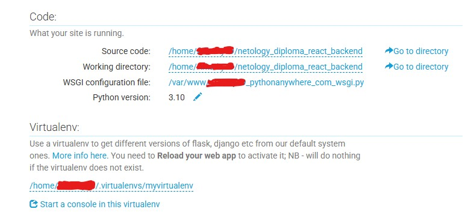

# Деплой бэкенда
[вернуться в корневой readme](../readme.md)

Поскольку с доступностью "импортных" веб-сервисов бесплатного хостинга приложений сейчас понятно что (май 2025), 
принято решение использовать Python и сервис pythonanywhere вместо исходного скрипта на js, поскольку код сервера на Node.js читаемый и переносимый.  
В качестве веб-фреймворка использован Flask из-за его относительной легковесности и простоты для быстрого старта.

Адрес сервиса - https://www.pythonanywhere.com/

### Шаги для деплоя сервиса на Pythonanywhere

Это не гайд, просто описана последовательность действий. В действительности можно и CI/CD-процесс выстроить.

Этапы:
1) зарегистрироваться на сервисе
2) открыть консоль, создать виртуальное окружение
```sh
mkvirtualenv myvirtualenv --python=/usr/bin/python3.10
```
окружение создастся и сразу активируется.  

3) в виртуальном окружении установить пакеты Flask и Flask-CORS  
```sh
pip install Flask
pip install flask-cors
```

4) создать web-приложение, следовать подсказкам мастера создания, выбрать фреймворк Flask и созданное окружение, настроить каталоги.  
Разместить файлы данных и скрипт, в скрипте указать хост для CORS и порт для прослушивания (на сервисе порты менять нельзя, только 80 или 443)
Запустить веб-приложение, проверить работу, убедиться в отсутствии ошибок в логе.  
Использовать url "боевого" хоста в .env-файле фронтенда.


